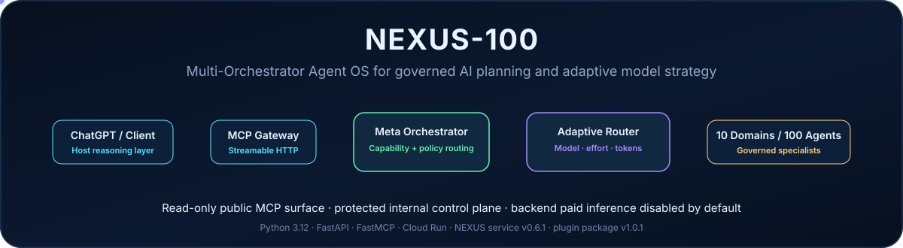

# NEXUS-100 Multi-Orchestrator Agent OS

**A governed Python orchestration layer for ChatGPT and MCP clients with 10 domain orchestrators, exactly 100 specialist agents, adaptive model/effort routing, and a deliberately read-only public MCP surface.**

[Live Architecture Console](https://hossain0707.github.io/NEXUS-100-Multi-Orchestrator-Agent-OS/) |
[Production Health](https://nexus-100-multi-orchestrator-agent-os-393741258321.asia-northeast3.run.app/health) |
[MCP Deployment Guide](docs/MCP_DEPLOYMENT.md) |
[Marketplace Package](marketplace/nexus-100/)

---

## Overview

NEXUS-100 is a **multi-orchestrator AI Agent OS** implemented in Python. It sits between an AI client and execution infrastructure to make task routing, specialist selection, model allocation, and governance explicit instead of hiding those decisions inside one monolithic prompt.

| Capability | Current state |
|---|---|
| Meta Orchestrator | Implemented |
| Domain orchestration | 10 fixed domains |
| Specialist registry | Exactly 100 capability-scoped agents |
| Capability routing | Deterministic keyword/capability routing |
| Adaptive model routing | Implemented |
| Reasoning-effort routing | Low / Medium / High / Extra High |
| Model catalog | Configured fallbacks + optional provider discovery |
| Governance policy | Implemented |
| REST control plane | Implemented |
| Streamable HTTP MCP | Implemented |
| Public MCP writes | Intentionally disabled |
| Backend paid inference | Implemented but disabled by default |
| Durable PostgreSQL/Redis deployment | Supported by configuration |
| GitHub/Gmail/cloud actions in public plugin | Not exposed |
| OAuth/RBAC user integrations | Future layer |
| Model-backed semantic routing | Future layer |

> NEXUS-100 is currently an **orchestration and control layer**. It does not claim to be a stronger base model than ChatGPT, and it does not pretend external side effects exist when they are not implemented.

## Architecture

~~~mermaid
flowchart LR
    A[ChatGPT / MCP Client / REST Client] --> B[FastAPI + Streamable HTTP MCP]
    B --> C[Meta Orchestrator]
    C --> D[Capability Router]
    D --> E[Adaptive Model / Effort Router]

    E --> R[Research]
    E --> G[Engineering]
    E --> BU[Business]
    E --> DK[Data and Knowledge]
    E --> I[Infrastructure]
    E --> S[Security]
    E --> P[Productivity]
    E --> F[Finance]
    E --> C2[Career]
    E --> PE[Personal]

    R --> X[100 Specialist Agents]
    G --> X
    BU --> X
    DK --> X
    I --> X
    S --> X
    P --> X
    F --> X
    C2 --> X
    PE --> X

    X --> GOV[Governance / Policy]
    GOV --> Y[Read-only result or protected execution path]
~~~

### Orchestration flow

~~~text
ChatGPT
  |
MCP
  |
NEXUS-100
  |
Meta Orchestrator
  |
Capability Router
  |
Adaptive Model / Effort Router
  |
Domain Orchestrators
  |
Specialist Agents
  |
Governance / Policy
~~~

The **public plugin path stops at planning and recommendation**. Consequential execution remains behind the protected control plane.

## Domain and Agent Matrix

Each domain contains exactly 10 specialists, producing a deterministic registry of **100 agents**.

| Domain | Agent IDs | Representative capabilities |
|---|---:|---|
| Research | A001-A010 | literature search, paper analysis, LLM research, experiments, fact checking, synthesis, patents, benchmarking, citations, technical writing |
| Engineering | A011-A020 | architecture, Python, APIs, debugging, testing, code review, DevOps, frontend, backend, automation |
| Business | A021-A030 | market research, product, strategy, sales, operations, competitive intelligence, requirements, pricing, partnerships, planning |
| Data & Knowledge | A031-A040 | RAG, ETL, SQL, analytics, knowledge graphs, document intelligence, vector search, data quality, evaluation, reporting |
| Infrastructure | A041-A050 | GPU, cloud, containers, Kubernetes, reliability, cost optimization, serving, monitoring, networking, capacity |
| Security | A051-A060 | threat analysis, dependency risk, incidents, secrets, compliance, audit, IAM, privacy, hardening, security review |
| Productivity | A061-A070 | email, documents, meetings, calendar, summaries, presentations, workflows, notes, scheduling, coordination |
| Finance | A071-A080 | budgeting, expenses, invoices, forecasting, procurement, cost analysis, unit economics, reporting, planning, controls |
| Career | A081-A090 | jobs, CV, portfolio, interviews, networking, skills, applications, research profile, learning, positioning |
| Personal | A091-A100 | travel, learning, planning, shopping, household, organization, research, scheduling, comparison, life admin |

The registry is defined in [nexus/registry.py](nexus/registry.py).

## Public MCP Surface

Production MCP endpoint:

~~~text
https://nexus-100-multi-orchestrator-agent-os-393741258321.asia-northeast3.run.app/mcp/
~~~

| Tool | Purpose | State change | Paid inference |
|---|---|---:|---:|
| <code>get_system_status</code> | Inspect public runtime capability state | No | No |
| <code>list_domains</code> | Discover domains and specialist capabilities | No | No |
| <code>plan_mission</code> | Preview a stateless multi-domain route | No | No |
| <code>list_model_catalog</code> | Inspect sanitized model-routing metadata | No | No |
| <code>recommend_model_strategy</code> | Recommend model, effort, token budget, and bounded fallbacks | No | No |

All public tools advertise:

~~~text
readOnlyHint=true
destructiveHint=false
idempotentHint=true
openWorldHint=false
~~~

The public plugin does **not** expose mission execution, deployment, deletion, payments, email sending, repository writes, cloud mutations, credential access, or other consequential actions.

## Adaptive Model and Effort Routing

Model choice is an execution policy above the specialist registry. A specialist agent is defined by its capability, not by a permanently assigned model.

| Decision | Values |
|---|---|
| Model tier | Fast -> Balanced -> Strong -> Premium |
| Reasoning effort | Low -> Medium -> High -> Extra High |
| Output budget | Configurable per effort level |
| Complexity score | Calculated from task complexity and scope |
| Confidence | Routing-policy confidence |
| Fallback chain | Bounded by <code>NEXUS_MAX_MODEL_ESCALATIONS</code> |
| Selection source | Configured fallback or discovered provider catalog |

When provider discovery is configured, [nexus/model_catalog.py](nexus/model_catalog.py) can query an OpenAI-compatible <code>/models</code> endpoint, cache discovered models, classify supported families, and prefer the least-cost qualified model or a suitable domain specialist.

| Tier | Default configured model |
|---|---|
| Fast | <code>gpt-6-luna</code> |
| Balanced | <code>gpt-5.6-terra</code> |
| Strong | <code>gpt-6.1-sol</code> |
| Premium | <code>gpt-6-astra</code> |

These are **backend configuration defaults**, not a claim about which model is selected in the ChatGPT interface.

> **Host-model boundary:** MCP cannot silently switch the model selected by a user in ChatGPT. NEXUS model strategy applies only to optional **NEXUS-managed backend inference**.

## Governance and Security Boundary

NEXUS separates public planning from protected execution.

| Scope | Autonomous policy |
|---|---|
| READ | Allowed |
| ANALYZE | Allowed |
| PROPOSE | Allowed |
| WRITE | Human approval required |
| EXECUTE | Human approval required |
| DELETE | Human approval required |
| FINANCIAL | Human approval required |
| EXTERNAL_COMMUNICATION | Human approval required |
| DEPLOY | Human approval required |

The public MCP surface contains only read/analyze/propose behavior. The internal REST control plane can be protected independently through <code>NEXUS_API_TOKEN</code>.

For public marketplace deployment:

~~~text
NEXUS_MCP_API_TOKEN=
NEXUS_BACKEND_MODEL_EXECUTION_ENABLED=false
~~~

For private MCP deployments, <code>NEXUS_MCP_API_TOKEN</code> can be configured separately.

## Production Deployment

The production service runs on Google Cloud Run.

| Item | Value |
|---|---|
| Service | <code>nexus-100-multi-orchestrator-agent-os</code> |
| Region | <code>asia-northeast3</code> |
| Runtime | Python 3.12 container |
| App server | Uvicorn |
| ASGI application | <code>nexus.main:app</code> |
| Container port | <code>8080</code> |
| Process user | Non-root UID 10001 |
| Service version | <code>0.6.1</code> |
| Backend paid inference | Disabled by default |

### Production endpoints

| Endpoint | Path | Purpose |
|---|---|---|
| Health | <code>/health</code> | Liveness / service version |
| Readiness | <code>/ready</code> | Readiness check |
| Public status | <code>/status</code> | Safe runtime snapshot |
| MCP | <code>/mcp/</code> | Streamable HTTP MCP |
| Strategy preview | <code>POST /demo/strategy</code> | Read-only public strategy preview |
| REST control plane | <code>/api/v1/*</code> | Protected internal API |
| OpenAI challenge | <code>/.well-known/openai-apps-challenge</code> | Domain verification when configured |

Production base URL:

~~~text
https://nexus-100-multi-orchestrator-agent-os-393741258321.asia-northeast3.run.app
~~~

## Quick Start

### Python

~~~bash
git clone https://github.com/hossain0707/NEXUS-100-Multi-Orchestrator-Agent-OS.git
cd NEXUS-100-Multi-Orchestrator-Agent-OS

python -m venv .venv
source .venv/bin/activate

pip install -e ".[dev]"
pytest -q
uvicorn nexus.main:app --reload --port 8080
~~~

### Windows PowerShell

~~~powershell
python -m venv .venv
.\.venv\Scripts\Activate.ps1
pip install -e ".[dev]"
pytest -q
uvicorn nexus.main:app --reload --port 8080
~~~

### Docker

~~~bash
docker build -t nexus-100-agent-os .
docker run --rm -p 8080:8080 nexus-100-agent-os
~~~

The container honors Cloud Run's platform-provided <code>PORT</code>.

## Configuration

Provide secrets through your deployment platform's secret manager rather than committing them.

| Variable | Default / expectation | Purpose |
|---|---|---|
| <code>NEXUS_ENVIRONMENT</code> | <code>development</code> | Runtime mode |
| <code>NEXUS_API_TOKEN</code> | Required in production | Protects internal REST control plane |
| <code>NEXUS_MCP_API_TOKEN</code> | Blank for public MCP | Optional private MCP bearer boundary |
| <code>NEXUS_DATABASE_URL</code> | SQLite under <code>/tmp</code> | Mission persistence backend |
| <code>NEXUS_REDIS_URL</code> | Optional | Future/distributed coordination |
| <code>NEXUS_MODEL_ROUTING_ENABLED</code> | <code>true</code> | Enables model-strategy calculation |
| <code>NEXUS_BACKEND_MODEL_EXECUTION_ENABLED</code> | <code>false</code> | Prevents accidental paid inference |
| <code>NEXUS_MODEL_DISCOVERY_ENABLED</code> | <code>true</code> | Provider model discovery when credentials exist |
| <code>NEXUS_MODEL_CATALOG_TTL_SECONDS</code> | <code>3600</code> | Catalog refresh TTL |
| <code>NEXUS_MAX_MODEL_ESCALATIONS</code> | <code>2</code> | Maximum stronger fallback attempts |
| <code>NEXUS_LLM_BASE_URL</code> | OpenAI-compatible endpoint | Optional backend provider |
| <code>NEXUS_LLM_API_KEY</code> | Blank | Optional provider credential |
| <code>NEXUS_OPENAI_APPS_CHALLENGE</code> | Blank until issued | Real submission-domain challenge token |

The default SQLite database is suitable for local development and zero-config startup. Cloud Run's <code>/tmp</code> filesystem is ephemeral, so durable multi-instance mission state should use PostgreSQL/Cloud SQL.

## REST Control Plane

| Method | Path | Purpose |
|---|---|---|
| GET | <code>/api/v1/agents</code> | Inspect all registered specialists |
| GET | <code>/api/v1/models</code> | Inspect model catalog |
| POST | <code>/api/v1/model-routing/recommend</code> | Calculate adaptive model strategy |
| POST | <code>/api/v1/missions</code> | Create a tracked mission |
| GET | <code>/api/v1/missions/{id}</code> | Read tracked mission |
| POST | <code>/api/v1/missions/{id}/queue</code> | Queue a mission for client handling |
| POST | <code>/api/v1/missions/{id}/execute-adaptive</code> | Optional protected backend execution |
| GET | <code>/api/v1/events</code> | Read development event history |

Production REST access should be protected with <code>NEXUS_API_TOKEN</code>.

## Repository Structure

| Path | Responsibility |
|---|---|
| [nexus/registry.py](nexus/registry.py) | Deterministic 100-agent registry |
| [nexus/orchestrator.py](nexus/orchestrator.py) | Meta orchestration and deterministic routing |
| [nexus/model_catalog.py](nexus/model_catalog.py) | Model discovery and catalog |
| [nexus/model_router.py](nexus/model_router.py) | Tier, effort, token-budget, fallback policy |
| [nexus/llm.py](nexus/llm.py) | Optional OpenAI-compatible provider adapter |
| [nexus/executor.py](nexus/executor.py) | Bounded adaptive backend execution |
| [nexus/policy.py](nexus/policy.py) | Governance / approval policy |
| [nexus/security.py](nexus/security.py) | Request limits and auth boundaries |
| [nexus/persistence.py](nexus/persistence.py) | SQLAlchemy mission persistence |
| [nexus/api.py](nexus/api.py) | REST control plane |
| [nexus/mcp_server.py](nexus/mcp_server.py) | Production public MCP contract |
| [nexus/main.py](nexus/main.py) | FastAPI application and MCP mount |
| [tests/](tests/) | Automated contract and invariant tests |
| [benchmarks/](benchmarks/) | Routing/governance benchmark corpus |
| [marketplace/nexus-100/](marketplace/nexus-100/) | OpenAI plugin package source |
| [docs/MCP_DEPLOYMENT.md](docs/MCP_DEPLOYMENT.md) | Production MCP/submission guide |
| [server.js](server.js) | Legacy standalone MCP development harness |

## Testing and Quality Gates

~~~bash
ruff check nexus tests
pytest -q
python benchmarks/run.py
docker build -t nexus-100-agent-os:test .
~~~

| Workflow | Coverage |
|---|---|
| Python Agent OS CI | Lint, full pytest suite, benchmark execution, Docker build |
| Marketplace Package | Marketplace/API tests, package build, ZIP CRC/content inspection, artifact upload |
| Legacy Node MCP CI | Legacy harness syntax validation |

Core tests enforce:

- exactly 100 registered agents;
- cross-domain routing behavior;
- adaptive model/effort decisions;
- bounded escalation;
- provider-model selection;
- persistence round trips;
- public MCP initialization;
- exact five-tool public surface;
- read-only MCP annotations;
- stateless public mission planning;
- OpenAI challenge behavior;
- REST/MCP authentication separation;
- marketplace manifest shape;
- minimal clean release ZIP.

## Benchmarks

The included deterministic benchmark measures **routing quality and governance-policy correctness**, not general intelligence.

| Metric | NEXUS-100 |
|---|---:|
| Routing macro precision | **0.926** |
| Routing macro recall | **0.938** |
| Routing macro F1 | **0.916** |
| Routing exact match | **70.0%** |
| Governance approval accuracy | **100.0%** |

A small routing-only ChatGPT baseline is included for transparency:

| System | Macro Precision | Macro Recall | Macro F1 | Exact Match |
|---|---:|---:|---:|---:|
| ChatGPT-only baseline | **1.000** | **0.975** | **0.983** | **95.0%** |
| NEXUS-100 deterministic router | 0.926 | 0.938 | 0.916 | 70.0% |

The current keyword router is not more accurate than the ChatGPT baseline on this small fixed corpus. NEXUS-100's present value is its **structured orchestration, explicit agent/domain control, governance boundaries, model-policy layer, reproducibility, and MCP integration**.

See [benchmarks/README.md](benchmarks/README.md) and [benchmarks/results/chatgpt_vs_nexus.md](benchmarks/results/chatgpt_vs_nexus.md).

## OpenAI Plugin Package

The repository contains a minimal public package under [marketplace/nexus-100/](marketplace/nexus-100/).

~~~bash
python marketplace/build_release.py
~~~

Expected artifact:

~~~text
marketplace/dist/nexus-100-plugin-1.0.1.zip
~~~

Expected ZIP contents:

~~~text
plugin.json
mcp.json
assets/icon.svg
assets/logo.svg
~~~

The package intentionally excludes source files, environment files, credentials, caches, tests, and unrelated repository content.

| Resource | URL |
|---|---|
| Website | [NEXUS-100](https://hossain0707.github.io/NEXUS-100-Multi-Orchestrator-Agent-OS/) |
| Support | [Support](https://hossain0707.github.io/NEXUS-100-Multi-Orchestrator-Agent-OS/support.html) |
| Privacy | [Privacy Policy](https://hossain0707.github.io/NEXUS-100-Multi-Orchestrator-Agent-OS/privacy.html) |
| Terms | [Terms of Service](https://hossain0707.github.io/NEXUS-100-Multi-Orchestrator-Agent-OS/terms.html) |

Publisher identity verification, the actual OpenAI-generated domain token, reviewer-accessible demo recording, policy attestations, and final portal submission remain account-owner/platform steps and are not fabricated in source code.

## Implementation Boundaries

### Implemented

- Python FastAPI control plane
- Streamable HTTP FastMCP server
- Meta Orchestrator
- deterministic capability router
- 10 domain orchestrators
- exactly 100 specialist agents
- adaptive model tier and reasoning-effort policy
- optional provider model discovery
- optional bounded backend execution
- policy/approval primitives
- SQLAlchemy mission persistence
- Docker/Cloud Run deployment
- public architecture dashboard
- marketplace/package validation
- domain-verification endpoint

### Optional and disabled by default

- paid backend model execution
- external provider model discovery requiring a provider credential
- durable production database configuration

### Not exposed as public plugin capabilities

- GitHub repository writes
- Gmail/Calendar/Drive actions
- cloud/Kubernetes deployment actions
- payment or commerce operations
- unrestricted database administration
- OAuth/RBAC-backed user accounts
- general shell execution

### Future engineering targets

- semantic or learned capability routing
- true DAG decomposition
- verifier/critic-driven quality escalation
- final multi-agent synthesis
- durable distributed queue/workers
- production PostgreSQL/Redis deployment
- authenticated provider adapters with least-privilege scopes
- broader benchmark corpus and independent evaluation

## Design Principles

1. **Capability before model** - agents represent work capabilities; model selection is a separate execution policy.
2. **Least-cost qualified compute** - use stronger compute only when the task/risk profile justifies it.
3. **Read by default** - public plugin capabilities remain non-consequential.
4. **Approval before side effects** - writes, deployments, spending, deletion, and communication require explicit governance.
5. **No fabricated integrations** - a provider capability is documented only when it is actually implemented.
6. **Reproducible behavior** - routing, model policy, tests, benchmarks, and package validation live in the repository.
7. **Clear host boundary** - NEXUS backend model routing never pretends to control ChatGPT's model picker.

## Contributing and Commercial Use

This repository is publicly visible for demonstration, evaluation, research discussion, and project development. Public visibility does **not** grant permission to copy, redistribute, relicense, commercialize, or create derivative works.

For collaboration, licensing, or commercial-use discussions, contact the repository owner through the [GitHub profile](https://github.com/hossain0707) or open an issue without including private information.

## License and Ownership

**Copyright (c) 2026 Hossain Md Najmul. All rights reserved.**

NEXUS-100 remains the intellectual property of **Hossain Md Najmul**. This repository is distributed under the project-specific proprietary [LICENSE](LICENSE). No open-source license is granted unless the copyright holder provides separate written permission.

Third-party dependencies remain subject to their own respective licenses.

---

**NEXUS-100**

Governed orchestration. Explicit routing. Adaptive compute. Honest boundaries.

Maintained by **Hossain Md Najmul**

